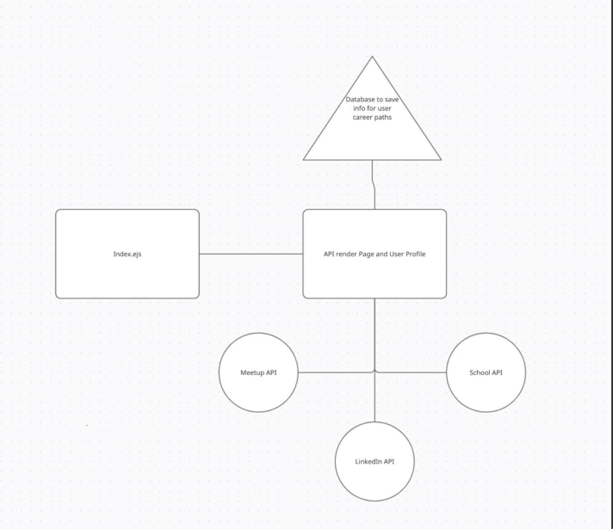

*Vision*

What is the vision of this product?

- To provide the user with a comprehensive path toward a new career.

What pain point does this project solve?

-This solves the pain point of finding all information regarding a new career.

- To provide the user with a comprehensive path toward a new career.

What pain point does this project solve?
- This solves the pain point of finding all information regarding a new career.

Why should we care about your product?
- This product will provide information for a clear path to start a new career.

*Scope In*

- The web app will provide information to the users about items necessary for transitioning into a new career.
- The web app will provide resources to assist the user in networking.
- The web app will provide wage/salary information.
- The web app will provide information on colleges, apprenticeship and different certications.

*Scope Out*

- This web app will not have the ability for users to write reviews.

*Minimum Viable Product vs*

What will your MVP functionality be?

- Generating search results from three API's, rendering it to the DOM and making the web app visually appealing. 

What are your stretch goals?

- Career Cafe: A place for users to have virtua coffee meetings!
- Salary information API
- Explore education opportunities for your new career
- Meet ups in your are! Join now and expand your network
- Job Opportunities for your future career!

What stretch goals are you going to aim for?

- Exploring education oppurtunites

*Functional Requirements*

- An admin can create and delete user accounts
- A user can update their profile information
- A user can search can find relevant information to that they need for their career transition.

### Data Flow

*Non-Functional Requirements* 

- Reliability: We intend for our app to be used on a consistent basis, therefore we will ensure that is readily available. 
- Interoperability: We are using three API's to run our app.
- Usability: We intend to develop an web app that is easy for users to navigate.
